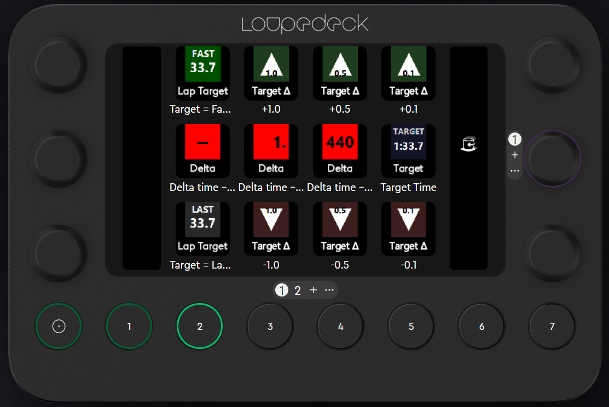

# Loupedeck SimHub Integration Plugin

SimHub Integration is a Loupedeck plugin that brings live racing telemetry from [SimHub](https://www.simhubdash.com/) onto your Loupedeck device.

Its main focus is an easy‑to‑read **Target Delta Display**: a three‑box layout that shows how far ahead or behind you are compared to your reference lap time, with clear color‑coded feedback.

> The screenshot above shows an example layout of the Target Delta Display on a Loupedeck device.

---

## Features

### Target Delta Display

- Visualizes live lap delta from SimHub across **three adjacent buttons**:
  - **Box 1 – Sign**: `+` or `−` (slower/faster than target)
  - **Box 2 – Seconds with decimal**: e.g. `0.`, `1.`
  - **Box 3 – Milliseconds**: three digits, e.g. `234`, `567`
- Background color reflects how far you are from your target pace (absolute delta):
  - **Green** – very close to target
  - **Yellow** – slightly off pace
  - **Orange** – off pace
  - **Red** – far from target
- Reads data from the SimHub *Dashboard Data Provider* plugin (HTTP API) so the display updates in real time as you drive.

For more details about the exact behavior, thresholds, and implementation, see **`DELTA_DISPLAY.md`**.

### Target Time Display

- A **Target** command that shows the currently configured target lap time.
- Uses a clear, large numeric layout so you can always see what time your delta is referenced against.

### Target Time Adjust Buttons

- A **Target Δ** command that exposes six variations to adjust target time directly from Loupedeck:
  - `+1.0 s`, `-1.0 s`
  - `+0.5 s`, `-0.5 s`
  - `+0.1 s`, `-0.1 s`
- Each variant renders as an up/down triangle with the step value overlaid.
- Pressing a button sends the requested adjustment to SimHub (via the Dashboard Data Provider), shifting your target lap time on the fly.

### Lap‑Based Target Setting

- A **Lap Target** command with two modes:
  - **Last Lap** – set target to your last completed lap time.
  - **Fastest Lap** – set target to your session best / fastest lap.
- Each mode shows the relevant lap time on the key and, when pressed, updates the target time in SimHub accordingly.

### Device Support

- Optimized for **Loupedeck CT family** devices (Loupedeck CT, Live, Live S, Razer Stream Controller, Razer Stream Controller X).
- Requires Loupedeck software **6.0 or newer**.

---

## Requirements

End‑user requirements:

- **Windows**
- **Loupedeck software 6.0+**
- A **Loupedeck CT family** device
- **SimHub** running on the same PC
- The [**SimHub Dashboard Data Provider**](https://github.com/kubofisla/DashboardDataProviderPlugin) plugin (or equivalent) exposing the telemetry HTTP API that this plugin reads (delta, lap times, target time, etc.).

Developer / contributor requirements are listed in **`DEVELOPMENT.md`**.

---

## Installation

### From a packaged plugin (`.lplug4`)

1. Download the latest `SimHubIntegration.lplug4` from the project’s releases (or your distribution source).
2. Double‑click the `.lplug4` file or open it from within the Loupedeck software.
3. Follow the prompts; Loupedeck will install the plugin.
4. Restart the Loupedeck software to ensure the plugin is loaded.

### From source (development setup)

If you want to build and run the plugin directly from this repository (using a `.link` file pointing at your build output), follow the detailed steps in **`DEVELOPMENT.md`**. It covers:

- How the `.link` file is created and where it must live.
- Expected build output layout (`bin/Debug` and `bin/Release`).
- How to restart and verify the plugin in Loupedeck.
- Troubleshooting tips for SimHub connectivity and delta display updates.

---

## Usage

### 1. Verify the plugin is loaded

1. Start the **Loupedeck** software.
2. Go to the **Plugins** tab.
3. Look for **"SimHubIntegration"** (or similar name) and confirm it is enabled.

If the plugin does not appear, see the troubleshooting notes in **`DEVELOPMENT.md`**.

### 2. Configure the Target Delta Display

1. In Loupedeck, open your device profile.
2. Search for the **Delta Display** trigger under the plugin (usually under a “Racing” or similar group).
3. Place **three instances** of the Delta Display trigger on **three adjacent buttons** in a row.
4. For each instance, set the **parameter**:
   - First button: **Sign**
   - Second button: **SecondsWithDecimal**
   - Third button: **Milliseconds**
5. Save / apply your layout.

As you drive in‑game with SimHub running, these three buttons together will show your live delta time relative to your target, with background colors indicating how close you are.

For a visual reference of the layout, see the screenshot at the top of this README and **`DELTA_DISPLAY.md`**.

### 3. Show the current target time

1. Add the **Target** command from the plugin to a button.
2. The key will display your current target lap time (as provided by SimHub).
3. Use this to always know which time your delta is computed against.

### 4. Adjust the target time from Loupedeck

1. Add one or more **Target Δ** command variants to buttons, choosing from:
   - `+1.0`, `-1.0`
   - `+0.5`, `-0.5`
   - `+0.1`, `-0.1`
2. Arrange them however is comfortable for you (for example, up‑arrows above the target key and down‑arrows below).
3. Pressing a button will nudge the target time by the configured amount and the Target/Delta displays will update accordingly.

### 5. Set target from last or fastest lap

1. Add the **Lap Target** command to two buttons:
   - One parameter for **LastLap**
   - One parameter for **FastestLap**
2. Each button displays the corresponding lap time from SimHub.
3. Pressing a button will send a command to SimHub to update the target time to that lap.

This makes it easy to:

- Use your **last lap** as a temporary target when doing consistency runs.
- Quickly set a new **session best** target after a strong lap.

---

## More documentation

- **`DELTA_DISPLAY.md`** – in‑depth explanation of the Target Delta Display behavior, color thresholds, and technical implementation.
- **`DEVELOPMENT.md`** – development and debugging notes, detailed installation for contributors, and troubleshooting steps.

If you encounter issues or have feature ideas, please open an issue or a pull request on the repository.
